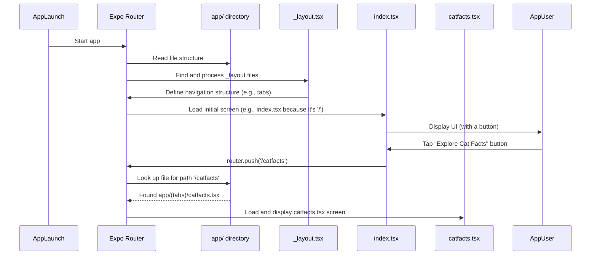

# Chapter 2: Expo Router Navigation

Welcome back to the `expo-for-architects` tutorial! In the previous chapter, [Project Structure](01_project_structure_.md), we got a lay of the land, understanding the main areas like the `app/` directory for our frontend and the `api/` for our backend. Now that we know *where* things are, let's learn *how* to move around within the frontend – specifically, how users navigate between different screens in our mobile and web application.

Imagine our application is a building with many rooms (screens). Navigation is like the hallways and doors that connect these rooms, allowing users to move from the "Entrance Hall" (Home screen) to the "Meeting Room" (Explore screen) or the "Kitchen" (Register screen). Without navigation, users would be stuck in just one room!

In Expo, this navigation is handled beautifully by a library called **Expo Router**. It has a super neat trick: it uses the files and folders you create inside the `app/` directory to automatically set up your navigation. This is called **file-based routing**.

Think of it like this: the `app/` folder is like a map, and each file inside it (that represents a screen) is a specific location on that map. Expo Router reads this map and knows how to get users from one location to another.

Let's look at a concrete example from our project: navigating from the main Home screen to the "Cat Facts" screen.

### The `app/` Directory Structure

Expo Router looks directly at the file structure inside `app/`.

Here's a simplified view of the part of our `app/` directory that's relevant to navigation:

```
app/
├── (tabs)/         # A group of routes that share a layout (like tabs)
│   ├── _layout.tsx # Defines the layout and tabs for this group
│   ├── index.tsx   # The Home screen (becomes '/')
│   ├── explore.tsx # The Explore screen (becomes '/explore')
│   ├── register.tsx # The Register screen (becomes '/register')
│   ├── catfact.tsx  # The Cat Fact screen (becomes '/catfact')
│   └── catfacts.tsx # The Cat Facts screen (becomes '/catfacts')
└── _layout.tsx     # Defines the root layout (wraps everything)
└── +not-found.tsx  # The 404 screen (becomes '/+not-found' or catches unknown routes)
```

*   **Folders become segments:** Each folder name becomes a part of the path. So, `app/(tabs)/index.tsx` means the route will be something related to `(tabs)/`.
*   **Files become routes:** Each `.tsx` file inside a folder becomes a route within that segment. `index.tsx` in a folder usually represents the default route for that segment.
*   **Special Files:**
    *   `_layout.tsx`: This file is special. It doesn't become a screen itself, but it defines the common look, feel, and structure for all the screens *within its folder*. In `app/(tabs)/_layout.tsx`, it sets up the tab bar you see at the bottom of the screen for the Home, Explore, Register, Cat Fact, and Cat Facts tabs.
    *   `+not-found.tsx`: This file is also special. It's displayed when a user tries to go to a route that doesn't exist.

So, based on this structure:
*   `app/(tabs)/index.tsx` corresponds to the route `/`.
*   `app/(tabs)/explore.tsx` corresponds to the route `/explore`.
*   `app/(tabs)/catfacts.tsx` corresponds to the route `/catfacts`.
*   And so on for the other files inside `(tabs)/`.

### Setting up the Layout with `_layout.tsx`

The `_layout.tsx` files are crucial for defining the navigation *structure*. The `app/(tabs)/_layout.tsx` file, for example, uses the `Tabs` component provided by Expo Router to create a tab-based navigation interface.

Let's look at a simplified version of `app/(tabs)/_layout.tsx`:

```typescript
import { Tabs } from 'expo-router';
import React from 'react';
import { useColorScheme } from 'react-native';

import { Colors } from '@/constants/Colors';

export default function TabLayout() {
  const colorScheme = useColorScheme();

  return (
    <Tabs
      screenOptions={{
        tabBarActiveTintColor: Colors[colorScheme ?? 'light'].tint,
        headerShown: false, // We don't want a header here, the header is in the root _layout
        // ... other styling options
      }}
    >
      <Tabs.Screen
        name="index" // Corresponds to app/(tabs)/index.tsx
        options={{
          title: 'Home',
          // ... tab bar icon setup
        }}
      />
      <Tabs.Screen
        name="explore" // Corresponds to app/(tabs)/explore.tsx
        options={{
          title: 'Explore',
           // ... tab bar icon setup
        }}
      />
      {/* ... other Tabs.Screen components for register, catfact, catfacts */}
       <Tabs.Screen
        name="catfacts" // Corresponds to app/(tabs)/catfacts.tsx
        options={{
          title: 'Cat Facts',
           // ... tab bar icon setup
        }}
      />
    </Tabs>
  );
}
```

In this code:
1.  We import the `Tabs` component from `expo-router`.
2.  We define a `TabLayout` component.
3.  Inside, we render the `Tabs` component.
4.  For *each* screen that should be part of these tabs, we add a `Tabs.Screen` component.
5.  The `name` prop of `Tabs.Screen` *must* match the filename (without the `.tsx` extension) in the `app/(tabs)/` directory. This is how Expo Router connects the screen component to the tab.
6.  The `options` prop lets us configure things specific to that tab, like its title (`title`) and the icon (`tabBarIcon`).

The `app/_layout.tsx` file at the root level works similarly but often uses the `Stack` component to create a traditional header bar that can navigate between full screens (including the entire tabs group).

### Navigating with `router.push()`

Now that the structure is defined by the files and `_layout.tsx`, how do we actually *make* the app move from one screen to another when a user taps a button?

This is done using the `router` object provided by `expo-router`. The most common method is `router.push(route)`. `push` adds the new screen onto the navigation stack, like adding a new card on top of a deck.

Let's look at the `app/(tabs)/index.tsx` file (the Home screen). It has a button to navigate to the "Cat Facts" screen.

Here's the relevant part from `app/(tabs)/index.tsx`:

```typescript
import { router } from 'expo-router'; // 1. Import router

// ... other imports and component definition

export default function HomeScreen() {
  // ... other state and hooks

  const handleExploreCatFacts = () => { // 2. Define a function to handle the button press
    router.push({ pathname: '/catfacts', params: { catFact: catFact?.fact } }); // 3. Use router.push
  };

  return (
      // ... other UI elements

      <ThemedButton
        title="Explore Cat Facts"
        onPress={handleExploreCatFacts} // 4. Attach the function to the button's onPress
      />
      // ... rest of the component
  );
}
```

Explanation:

1.  We import the `router` object from `expo-router`.
2.  We create a function `handleExploreCatFacts` that will be called when the button is pressed.
3.  Inside the function, we call `router.push()`.
    *   `pathname: '/catfacts'` tells Expo Router which screen file to navigate to. Since `catfacts.tsx` is inside `(tabs)/`, its path is `/catfacts` relative to the root.
    *   `params: { catFact: catFact?.fact }` is an optional object where you can pass data to the screen you're navigating *to*. The target screen (`/catfacts`) can then access this data. We'll see how to receive parameters in a later chapter if needed, but for now, just know you can send data this way.
4.  We connect this function to the `onPress` prop of our `ThemedButton`.

When the user taps the "Explore Cat Facts" button, `router.push('/catfacts')` is executed, and Expo Router takes them to the screen defined by `app/(tabs)/catfacts.tsx`.

### How Expo Router Connects the Dots (Simplified)

Let's visualize what happens when the app starts and when you navigate:



Essentially, Expo Router:
1.  Scans your `app/` directory when the app starts.
2.  Builds an internal map of routes based on the file names and folder structure, guided by `_layout.tsx` files.
3.  When `router.push()` is called with a path, it looks up that path in its internal map and displays the corresponding screen component.

This file-based approach is different from traditional navigation libraries where you might manually define routes in a separate configuration file. With Expo Router, the structure *is* the configuration!

### What about the `+not-found.tsx` file?

We also saw `app/+not-found.tsx`. This is the screen that Expo Router will automatically display if `router.push()` is called with a path that doesn't match any file in your `app/` directory. It acts as a fallback for unknown routes, similar to a 404 page on a website.

### Conclusion

In this chapter, we learned how Expo Router handles navigation by using the `app/` directory's file structure as its map. We saw how `_layout.tsx` files define the navigation structure (like tabs) and how the `router` object, particularly `router.push()`, is used in screen components to move users between these defined routes. This file-based system makes it intuitive to understand where each screen lives and how it's connected to others.

Now that we know how to move between screens, let's make those screens look good and consistent! In the next chapter, we'll explore [Themed UI Components](03_themed_ui_components_.md) and how the project uses them to handle light and dark modes.

[Next Chapter: Themed UI Components](03_themed_ui_components_.md)

---

<sub><sup>Generated by [AI Codebase Knowledge Builder](https://github.com/The-Pocket/Tutorial-Codebase-Knowledge).</sup></sub> <sub><sup>**References**: [[1]](https://github.com/pjnalls/expo-for-architects/blob/f3697ca8ad9d64b842d61f5b3cad4bc1ca57a63b/app/(tabs)/_layout.tsx), [[2]](https://github.com/pjnalls/expo-for-architects/blob/f3697ca8ad9d64b842d61f5b3cad4bc1ca57a63b/app/(tabs)/index.tsx), [[3]](https://github.com/pjnalls/expo-for-architects/blob/f3697ca8ad9d64b842d61f5b3cad4bc1ca57a63b/app/(tabs)/register.tsx), [[4]](https://github.com/pjnalls/expo-for-architects/blob/f3697ca8ad9d64b842d61f5b3cad4bc1ca57a63b/app/+not-found.tsx), [[5]](https://github.com/pjnalls/expo-for-architects/blob/f3697ca8ad9d64b842d61f5b3cad4bc1ca57a63b/app/_layout.tsx)</sup></sub>