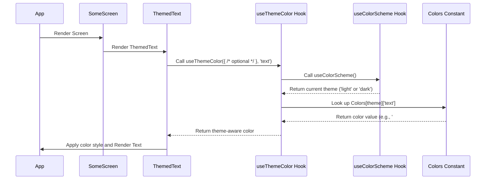

# Chapter 3: Themed UI Components

Welcome back! In the last chapter, [Expo Router Navigation](02_expo_router_navigation_.md), we learned how to move users between different screens in our application using Expo Router's file-based navigation. Now that we know how to get users *to* a screen, let's focus on making those screens look great and, more importantly, consistent, no matter if the user prefers a bright **light mode** or a sleek **dark mode**.

Imagine you're decorating a house. You want the paint colors, furniture, and decorations in each room to work together, and maybe even change slightly depending on the time of day or your mood. In our app, we want the buttons, text, backgrounds, and other interface elements to look harmonious and automatically adapt their colors when the user switches their phone's theme between light and dark mode.

Manually changing the color of *every single text element* or *every single button* based on the theme would be a nightmare! It would make our code repetitive and hard to update.

This is where **Themed UI Components** come in. They are like smart building blocks for our user interface that already know how to pick the right color based on the app's current theme. We create these components once, and then we can use them everywhere in our app, knowing they will always follow the theme.

### The Core Idea: Theme-Aware Styling

The concept relies on a few key pieces working together:

1.  **Knowing the Current Theme:** How does the app know if it's in light mode or dark mode?
2.  **A Central Color Palette:** Where do we store the specific colors to use for light mode and dark mode?
3.  **A Smart Helper:** How do we easily get the *correct* color (light or dark version) for a specific design element (like text or a background)?
4.  **Reusable Components:** How do we wrap this logic into components like `Text`, `View`, `Button`, etc., so we don't have to repeat the theme logic every time?

Let's look at how our project addresses these points.

### 1 & 2: Knowing the Theme and the Colors (`useColorScheme` and `Colors.ts`)

React Native (which Expo is built on) provides a hook called `useColorScheme` that tells you the user's preferred color scheme ('light', 'dark', or 'no-preference').

Our project defines a central place for all the colors used in the app: the `constants/Colors.ts` file. This file exports an object named `Colors` that has two main properties: `light` and `dark`. Inside `light`, we list all the colors for light mode (e.g., background is white, text is dark). Inside `dark`, we list the corresponding colors for dark mode (e.g., background is dark, text is light).

Here's a simplified look at `constants/Colors.ts`:

```typescript
// constants/Colors.ts
const tintColorLight = '#0a7ea4'; // A specific light color
const tintColorDark = '#fff';   // A specific dark color

export const Colors = {
  light: {
    text: '#11181C', // Dark text for light mode
    background: '#fff', // White background for light mode
    tint: tintColorLight, // Use light tint color
    // ... other colors for light mode
  },
  dark: {
    text: '#ECEDEE', // Light text for dark mode
    background: '#151718', // Dark background for dark mode
    tint: tintColorDark, // Use dark tint color
    // ... other colors for dark mode
  },
};
```

This `Colors` object is like our app's paint store, with different color swatches for both themes, neatly organized.

### 3: The Smart Helper (`useThemeColor` Hook)

Now we have the current theme (from `useColorScheme`) and the color palettes (`Colors.ts`). We need a way to easily combine them. Our project has a custom hook for this, located at `hooks/useThemeColor.ts`.

This `useThemeColor` hook takes two main things:
1.  An object with potential custom colors for *this specific element* (`{ light?: string; dark?: string }`).
2.  The `colorName` (like 'text' or 'background') from the standard `Colors` palette you want to use as a fallback.

It uses `useColorScheme` to figure out the current theme and then looks up the correct color in the `Colors` object based on that theme and the provided `colorName`. If you provide custom colors in the first argument, it uses those instead.

Here's a simplified look at `hooks/useThemeColor.ts`:

```typescript
// hooks/useThemeColor.ts
import { Colors } from '@/constants/Colors';
import { useColorScheme } from '@/hooks/useColorScheme'; // Use the system hook

export function useThemeColor(
  props: { light?: string; dark?: string }, // Optional specific colors
  colorName: keyof typeof Colors.light     // Name of the color from Colors.ts
) {
  const theme = useColorScheme() ?? 'light'; // Get current theme, default to 'light'
  const colorFromProps = props[theme];     // Check if specific theme color is provided

  if (colorFromProps) {
    return colorFromProps; // Use specific color if available
  } else {
    return Colors[theme][colorName]; // Otherwise, use the color from the standard palette
  }
}
```

This hook is the "brain" that picks the right color swatch based on the current theme and the requested color name.

### 4: Reusable Themed Components

The final step is to create simple wrapper components that use the `useThemeColor` hook to automatically style themselves. These components live in the `components/` directory.

Let's look at two simple examples: `ThemedText` and `ThemedView`.

**`components/ThemedText.tsx`**

```typescript
// components/ThemedText.tsx
import { Text, type TextProps, StyleSheet } from 'react-native';
import { useThemeColor } from '@/hooks/useThemeColor'; // Import our helper hook

export type ThemedTextProps = TextProps & {
  lightColor?: string; // Optional custom light color
  darkColor?: string;  // Optional custom dark color
  type?: 'default' | 'title' | 'link'; // Different text styles
};

export function ThemedText({
  style,
  lightColor,
  darkColor,
  type = 'default',
  ...rest
}: ThemedTextProps) {
  // Use the hook to get the text color based on the theme
  const color = useThemeColor({ light: lightColor, dark: darkColor }, 'text');

  return (
    <Text
      // Apply the theme-aware color and any other styles
      style={[
        { color },
        // Apply styles based on the 'type' prop (defined below)
        type === 'default' ? styles.default : undefined,
        // ... other type styles
        style, // Allow overriding with custom styles
      ]}
      {...rest}
    />
  );
}

// Basic styles for different text types (simplified)
const styles = StyleSheet.create({
  default: {
    fontSize: 16,
  },
  title: {
    fontSize: 32,
    fontWeight: 'bold',
  },
  link: {
    color: '#0a7ea4', // Note: This link color isn't using useThemeColor here
  },
});
```

**`components/ThemedView.tsx`**

```typescript
// components/ThemedView.tsx
import { View, type ViewProps } from 'react-native';
import { useThemeColor } from '@/hooks/useThemeColor'; // Import our helper hook

export type ThemedViewProps = ViewProps & {
  lightColor?: string; // Optional custom light color
  darkColor?: string;  // Optional custom dark color
};

export function ThemedView({ style, lightColor, darkColor, ...otherProps }: ThemedViewProps) {
  // Use the hook to get the background color based on the theme
  const backgroundColor = useThemeColor({ light: lightColor, dark: darkColor }, 'background');

  return (
    // Apply the theme-aware background color and any other styles
    <View style={[{ backgroundColor }, style]} {...otherProps} />
  );
}
```

These components are simple wrappers. They don't add much complex logic themselves; their main job is to use `useThemeColor` to get the right color and apply it as a style to the basic React Native `Text` or `View`.

### How to Use Themed Components in a Screen

Using these components is just like using the standard `Text` or `View`, but you get the theme adaptation automatically!

Let's imagine a simplified screen component:

```typescript
// app/(tabs)/some-screen.tsx (Example usage)
import { ThemedText } from '@/components/ThemedText';
import { ThemedView } from '@/components/ThemedView';

export default function SomeScreen() {
  return (
    // ThemedView automatically gets the theme's background color
    <ThemedView style={{ flex: 1, padding: 20, justifyContent: 'center' }}>
      {/* ThemedText automatically gets the theme's text color */}
      <ThemedText type="title" style={{ textAlign: 'center' }}>
        Welcome!
      </ThemedText>
      <ThemedText style={{ marginTop: 10 }}>
        This text changes color with the theme!
      </ThemedText>
      {/* You could add ThemedButtons, ThemedTextInputs here too */}
    </ThemedView>
  );
}
```

When this screen renders, the `ThemedView` asks `useThemeColor` for the 'background' color, and `ThemedText` asks for the 'text' color. `useThemeColor` checks the current theme and returns the color from `Colors.light` or `Colors.dark` accordingly. If the user switches their theme in their phone settings, the components will re-render and `useThemeColor` will provide the color for the *new* theme. Magic!

### How it Works Under the Hood

Let's trace what happens when a `ThemedText` component is rendered:



This diagram shows the flow: the screen renders `ThemedText`, which internally calls `useThemeColor`. The hook determines the current theme using `useColorScheme` and fetches the correct color from the `Colors` constant before returning it to `ThemedText`, which then applies it to the actual `Text` element.

The other themed components like `ThemedButton` and `ThemedTextInput` (seen in the project's `components/` directory) follow a similar pattern. They use `useThemeColor` or other theme-aware hooks (like `useTheme` from `@react-navigation/native`, which works similarly but is specifically tied to the navigation library's theme) to determine colors for backgrounds, text, borders, etc., based on the current theme. Some might also use styling libraries like Nativewind (which provides Tailwind CSS classes) with theme-specific variations (e.g., `dark:text-white`). The core idea is the same: pick styles based on the theme.

### Conclusion

By using a combination of the system's `useColorScheme` hook, a central `Colors` constant, and a custom `useThemeColor` helper hook, our project creates reusable Themed UI Components. These components handle the logic of picking the correct color based on the current theme, allowing us to build consistent and theme-adaptive user interfaces throughout the application with minimal effort in our screen components. This makes our app look good in both light and dark modes and simplifies future styling changes.

Now that we have our UI components ready to adapt to the theme, what about managing data that needs to be shared across different parts of the app? In the next chapter, we'll explore [React Context State Management](04_react_context_state_management_.md) to handle shared data like the theme setting itself or other global application state.

[Next Chapter: React Context State Management](04_react_context_state_management_.md)

---

<sub><sup>Generated by [AI Codebase Knowledge Builder](https://github.com/The-Pocket/Tutorial-Codebase-Knowledge).</sup></sub> <sub><sup>**References**: [[1]](https://github.com/pjnalls/expo-for-architects/blob/f3697ca8ad9d64b842d61f5b3cad4bc1ca57a63b/components/ThemedButton.tsx), [[2]](https://github.com/pjnalls/expo-for-architects/blob/f3697ca8ad9d64b842d61f5b3cad4bc1ca57a63b/components/ThemedText.tsx), [[3]](https://github.com/pjnalls/expo-for-architects/blob/f3697ca8ad9d64b842d61f5b3cad4bc1ca57a63b/components/ThemedTextInput.tsx), [[4]](https://github.com/pjnalls/expo-for-architects/blob/f3697ca8ad9d64b842d61f5b3cad4bc1ca57a63b/components/ThemedView.tsx), [[5]](https://github.com/pjnalls/expo-for-architects/blob/f3697ca8ad9d64b842d61f5b3cad4bc1ca57a63b/constants/Colors.ts), [[6]](https://github.com/pjnalls/expo-for-architects/blob/f3697ca8ad9d64b842d61f5b3cad4bc1ca57a63b/hooks/useThemeColor.ts)</sup></sub>