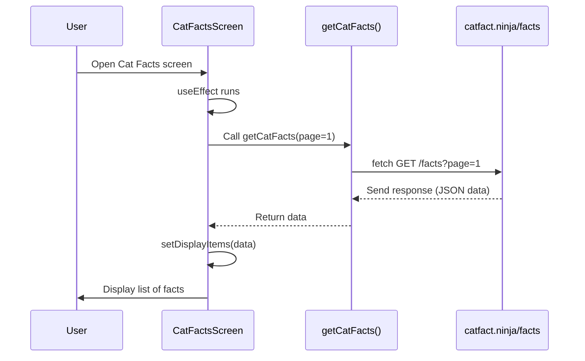
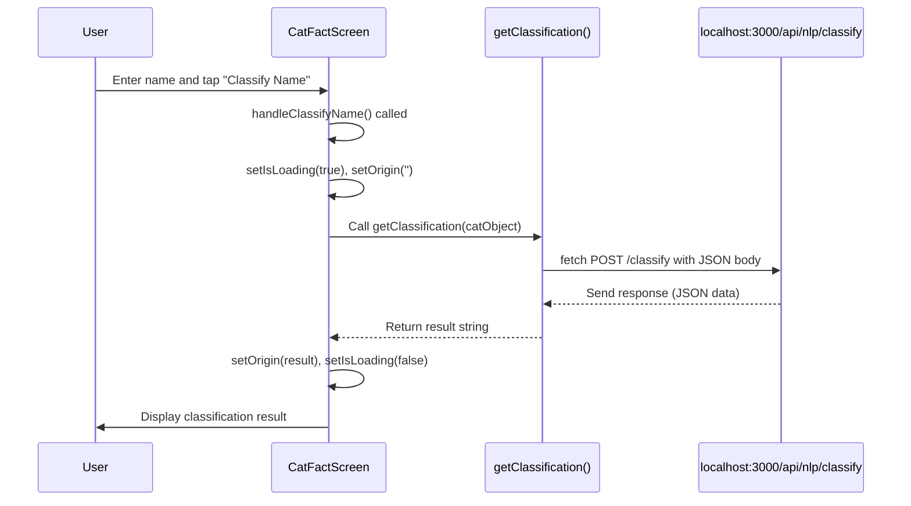

# Chapter 5: Frontend API Interaction

Welcome back! In our previous chapter, [React Context State Management](04_react_context_state_management_.md), we learned how to manage and share data within our frontend application using React Context, making it easier for different screens and components to access the same information (like the selected cat fact). But where does this information *originally* come from? Often, the data our application displays and interacts with lives outside the frontend itself – on servers, either our own backend or external third-party services.

Imagine our frontend application is a bustling restaurant kitchen (the UI, components, state management) where delicious food is prepared and served to the customers (the users). But this kitchen doesn't grow its own ingredients! It needs to **order** them from suppliers or get prepared items from a central commissary.

In the world of software, these "ingredients" or "prepared items" are data, and the "suppliers" or "commissary" are **APIs (Application Programming Interfaces)**. APIs are sets of rules and protocols for building and interacting with software applications. In simple terms, they allow different software systems to talk to each other. Our frontend talks to a backend API (which we'll build later) and also to external APIs provided by other companies (like a service that provides random cat facts).

This communication process, where our frontend sends requests to an API and receives responses back, is called **Frontend API Interaction**. It's like our restaurant kitchen placing an order with a supplier – the kitchen sends a specific request (e.g., "We need 5 pounds of tomatoes"), and the supplier sends back the requested ingredients (or perhaps says they're out of stock!).

### The Problem: Getting Data and Triggering Actions from Outside

Our frontend needs to:
1.  **Fetch data** to display to the user (e.g., a list of cat facts).
2.  **Send data** to a server to trigger an action (e.g., sending a cat name to our backend to classify its origin using AI).

We need a standardized way for our frontend code to make these "orders" or "requests" to various APIs and handle the "deliveries" or "responses" it gets back.

### The Tool: The `fetch` API

In web browsers and React Native (which Expo uses), the standard built-in tool for making these API requests is the **`fetch` API**. `fetch` allows us to easily send HTTP requests (like GET, POST, PUT, DELETE) to a specified URL and get the response back.

Think of `fetch` as the delivery person who takes your order from the kitchen, goes to the supplier (the API), gets the items, and brings them back.

### Making Different Kinds of Orders (HTTP Methods)

Just like a kitchen might have different types of orders (requesting ingredients, returning spoiled goods, confirming delivery), API interactions use different methods to indicate the type of action being requested:

*   **GET:** Requesting data from the API. Like asking the supplier, "What types of tomatoes do you have?" This method usually doesn't send a body with the request, as it's just asking for information.
*   **POST:** Sending data to the API to create a new resource or trigger an action. Like sending an order form to the supplier saying, "Please send us 5 pounds of plum tomatoes." This method typically includes a "body" containing the data being sent (often in JSON format).
*   **Other methods (PUT, DELETE, etc.):** Used for updating or deleting resources, but we'll focus on GET and POST for our examples.

### Use Case 1: Fetching Cat Facts (A GET Request)

Let's look at how our frontend gets a list of cat facts from an *external* API (`catfact.ninja`). This is a classic **GET** request – we're simply asking the API to give us data.

The project has a dedicated file for interacting with the external Cat Fact API: `api/endpoints/vendors/CatFact.ts`. This is a good practice – keep your API interaction code separate from your UI code.

Here's a simplified look at the function that fetches a list of facts:

```typescript
// api/endpoints/vendors/CatFact.ts
import { CatFact } from '@/types/Cat'; // Data structure definition

const CatFactAPIEndpoint = 'https://catfact.ninja'; // Base URL

export async function getCatFacts(
  page: number
): Promise<CatFact[] | undefined> {
  const json: { data: CatFact[] } | undefined = await fetch(
    // 1. Call fetch with the specific URL (GET is default)
    `${CatFactAPIEndpoint}/facts?page=${page}`
  )
    // 2. Handle the response
    .then((res) => {
      if (!res.ok) {
        // Check if the request was successful (status 200-299)
        console.log('Error fetching cat facts:', res.status);
        return undefined; // Return undefined on error
      }
      return res.json(); // 3. Parse the response body as JSON
    })
    .catch((e) => {
      // 4. Handle network errors
      console.error('Network error fetching cat facts:', e);
      return undefined;
    });
  return json?.data; // 5. Return the relevant data
}
```

Explanation:

1.  `fetch(`${CatFactAPIEndpoint}/facts?page=${page}`)`: This is the core of the request. We call `fetch` with the full URL for the facts endpoint, including a query parameter for the `page` number. Since we don't provide any other options, `fetch` automatically uses the `GET` method.
2.  `.then((res) => { ... })`: Once the API responds, the `.then` block runs. `res` is the response object. We first check `!res.ok` to see if the HTTP status code indicates success (like 200 OK).
3.  `return res.json()`: If the request was successful (`res.ok` is true), we call `res.json()` to parse the response body, which is expected to be JSON, into a JavaScript object. This is an asynchronous operation itself, so it returns another Promise.
4.  `.catch((e) => { ... })`: If anything goes wrong during the request (like a network issue or the server being down), the `.catch` block runs. We log the error and return `undefined`.
5.  `return json?.data`: The `catfact.ninja/facts` API wraps the list of facts in a `data` property, so we return `json.data` (using `?.` for safety in case `json` is undefined).

This `getCatFacts` function is now a reusable way for our frontend to get cat facts.

**How it's used in the frontend (`app/(tabs)/catfacts.tsx`):**

The `CatFactsScreen` needs to call this function when it loads and when the user scrolls to the end of the list to fetch more facts.

```typescript
// app/(tabs)/catfacts.tsx - Simplified relevant parts
import { getCatFacts } from '@/api/endpoints/vendors/CatFact'; // Import the function
import { CatFact } from '@/types/Cat';
import React, { useState } from 'react';
import { FlatList, StyleSheet, TouchableOpacity, View } from 'react-native';

export default function CatFactsScreen() {
  const [displayItems, setDisplayItems] = useState<CatFact[] | null>(null);
  const [page, setPage] = useState<number>(1);
  const [isLoading, setIsLoading] = useState<boolean>(true);

  const fetchItems = async () => {
    setIsLoading(true);
    const data = await getCatFacts(page); // 1. Call the API function
    setPage(page + 1);
    // 2. Update local state with the fetched data
    setDisplayItems((items) => (items ? items.concat(data ?? []) : data ?? []));
    setIsLoading(false);
  };

  React.useEffect(() => {
    // 3. Fetch data when the component mounts
    fetchItems();
  }, []); // The empty array [] means this runs only once on mount

  const onEndReached = () => {
    if (!isLoading) {
      fetchItems(); // 4. Fetch more data when scrolling reaches the end
    }
  };

  // ... rest of the component rendering the FlatList with renderItem={...}
}
```

Explanation:

1.  `const data = await getCatFacts(page);`: We call our API helper function `getCatFacts`. Since it's an `async` function and returns a Promise, we use `await` to wait for the data to come back.
2.  `setDisplayItems(...)`: Once `data` is received, we use our local state updater (`setDisplayItems`) to add the new facts to the list displayed in the `FlatList`. Updating state triggers a re-render of the component.
3.  `React.useEffect(() => { fetchItems(); }, []);`: This `useEffect` hook ensures that `fetchItems` is called automatically when the `CatFactsScreen` first appears.
4.  `onEndReached={onEndReached}`: The `FlatList` component has an `onEndReached` prop that triggers a function when the user scrolls near the end of the list. We call `fetchItems` again here to load the *next* page of facts, creating an infinite scrolling effect.

**How it Works (Fetching Data Flow):**



### Use Case 2: Classifying a Cat Name (A POST Request)

Now let's look at interacting with our *local* backend API (running on `localhost:3000/api`). On the `/catfact` detail screen (`app/(tabs)/catfact.tsx`), the user can enter a cat name and ask the AI (which runs on our backend) to classify its origin. This requires sending the entered name to our backend, which is a **POST** request because we are sending data to trigger a process.

The project has a file for interacting with our local NLP (Natural Language Processing) backend endpoint: `api/endpoints/Nlp.ts`.

Here's a simplified look at the function that sends data for classification:

```typescript
// api/endpoints/Nlp.ts
import { Cat } from "@/types/Cat"; // Data structure for Cat object

const NlpApiEndpoint = 'http://localhost:3000/api/nlp'; // Base URL for local NLP API

export async function getClassification(cat: Cat): Promise<string | undefined> {
  const json: { data: string } | undefined = await fetch(
    `${NlpApiEndpoint}/classify`, // 1. Call fetch with the specific URL
    {
      method: 'POST', // 2. Specify the POST method
      headers: {
        'Content-Type': 'application/json', // 3. Tell the server we're sending JSON
      },
      body: JSON.stringify(cat), // 4. Include the data (Cat object) as a JSON string in the body
    }
  )
    // 5. Handle the response (similar to GET)
    .then((res) => {
      if (!res.ok) {
        console.log('Error classifying text', res.status);
        return undefined;
      }
      return res.json().then((data) => data.data); // 6. Parse JSON and extract specific property
    })
    .catch((e) => {
      console.log('Network error classifying text', e);
      return undefined;
    });
  return json; // 7. Return the classification result
}
```

Explanation:

1.  `fetch(`${NlpApiEndpoint}/classify`, { ... })`: We call `fetch` with the URL of the classification endpoint and a second argument: an options object.
2.  `method: 'POST'`: This tells `fetch` to use the POST HTTP method instead of the default GET.
3.  `headers: { 'Content-Type': 'application/json' }`: Headers provide metadata about the request. The `Content-Type` header is crucial for POST requests that send JSON; it tells the server what format the body data is in.
4.  `body: JSON.stringify(cat)`: The `body` property contains the data we are sending. We use `JSON.stringify()` to convert our JavaScript `cat` object into a JSON string, as required by the `Content-Type` header.
5.  `.then((res) => { ... })`: Handle the response as before, checking `res.ok`.
6.  `return res.json().then((data) => data.data)`: Parse the JSON response. In this case, our *local* backend is designed to return the classification result within a `data` property (like `{ "data": "Origin: Europe" }`), so we access `data.data`.
7.  `return json`: Return the extracted classification string.

**How it's used in the frontend (`app/(tabs)/catfact.tsx`):**

The `CatFactScreen` has an input field for the name and a button to trigger the classification.

```typescript
// app/(tabs)/catfact.tsx - Simplified relevant parts
import { ThemedTextInput } from '@/components/ThemedTextInput';
import ThemedButton from '@/components/ThemedButton';
import { useState } from 'react';
import { getClassification } from '@/api/endpoints/Nlp'; // Import the function
import { Cat } from '@/types/Cat'; // Import the type

export default function CatFactScreen() {
  const { catFact } = useCatFact(); // Get the current fact from Context
  const [name, setName] = useState(''); // State for the input field
  const [origin, setOrigin] = useState(''); // State for the classification result
  const [isLoading, setIsLoading] = useState(false); // State for loading indicator

  const handleNameChange = (text: string) => {
    setName(text); // Update name state when input changes
  };

  const handleClassifyName = async () => {
    setOrigin(''); // Clear previous result
    setIsLoading(true); // Show loading indicator

    const cat: Cat = { // Create the object to send
      firstName: name,
      lastName: 'Leon', // Dummy data for other fields
      email: 'leon@gmail.com',
      birthDate: new Date().toISOString(),
      catBreed: [{ name: 'Persian', checked: true }],
    };

    // 1. Call the API function to send data
    const originResult = await getClassification(cat);

    // 2. Update state with the result and hide loading
    setOrigin(originResult ?? 'Unknown');
    setIsLoading(false);
  };

  return (
    // ... component structure
    <ThemedTextInput
      onChangeText={handleNameChange}
      label="name"
      value={name}
      // ... validation props
    />
    <ThemedButton
      onPress={handleClassifyName} // 3. Attach handler to button press
      disabled={isLoading || !name || name.length < 3}
      title={isLoading ? "Classifying..." : "Classify Name"}
    />
    {/* ... display originResult or loading indicator */}
  );
}
```

Explanation:

1.  `const originResult = await getClassification(cat);`: When the button is pressed, `handleClassifyName` is called. We construct a `Cat` object (using the entered `name`) and call our API helper function `getClassification`, waiting for the result.
2.  `setOrigin(originResult ?? 'Unknown'); setIsLoading(false);`: Once the API response comes back, we update the `origin` state with the result and hide the loading indicator. Updating the `origin` state triggers a re-render to display the result.
3.  `onPress={handleClassifyName}`: We connect the `handleClassifyName` function to the button's `onPress` prop.

**How it Works (Sending Data Flow):**



### Handling Errors

You'll notice both `getCatFacts` and `getClassification` include `.then` blocks that check `!res.ok` and `.catch` blocks. This is crucial for robust API interaction:

*   `!res.ok`: Checks for HTTP status codes in the 400s or 500s (like 404 Not Found, 500 Internal Server Error). This means the server *responded*, but it indicated an error related to the request.
*   `.catch`: Catches errors that prevent a response from being received at all (like a network connection issue, or the server not running).

In a real application, you would often show an error message to the user based on these checks. Here, we simply log the error and return `undefined`.

### Summary

Frontend API Interaction is the vital process of your application talking to the outside world to get or send data. We learned how to use the standard `fetch` API to make different types of requests (GET for fetching data, POST for sending data) and how to handle the responses, including basic error checking. By creating small, focused functions in dedicated files (like those in `api/endpoints`), we keep our API logic organized and easy to use within our screen components.

Now that we understand how the frontend sends requests, let's look at the other side of the conversation: how our local backend API receives and processes those requests. In the next chapter, we'll dive into the [Backend API (Express)](06_backend_api__express__.md) and see how it handles the requests we just learned to send!

[Next Chapter: Backend API (Express)](06_backend_api__express__.md)

---

<sub><sup>Generated by [AI Codebase Knowledge Builder](https://github.com/The-Pocket/Tutorial-Codebase-Knowledge).</sup></sub> <sub><sup>**References**: [[1]](https://github.com/pjnalls/expo-for-architects/blob/f3697ca8ad9d64b842d61f5b3cad4bc1ca57a63b/api/endpoints/Cat.ts), [[2]](https://github.com/pjnalls/expo-for-architects/blob/f3697ca8ad9d64b842d61f5b3cad4bc1ca57a63b/api/endpoints/Nlp.ts), [[3]](https://github.com/pjnalls/expo-for-architects/blob/f3697ca8ad9d64b842d61f5b3cad4bc1ca57a63b/api/endpoints/vendors/CatFact.ts), [[4]](https://github.com/pjnalls/expo-for-architects/blob/f3697ca8ad9d64b842d61f5b3cad4bc1ca57a63b/app/(tabs)/catfact.tsx), [[5]](https://github.com/pjnalls/expo-for-architects/blob/f3697ca8ad9d64b842d61f5b3cad4bc1ca57a63b/app/(tabs)/catfacts.tsx)</sup></sub>