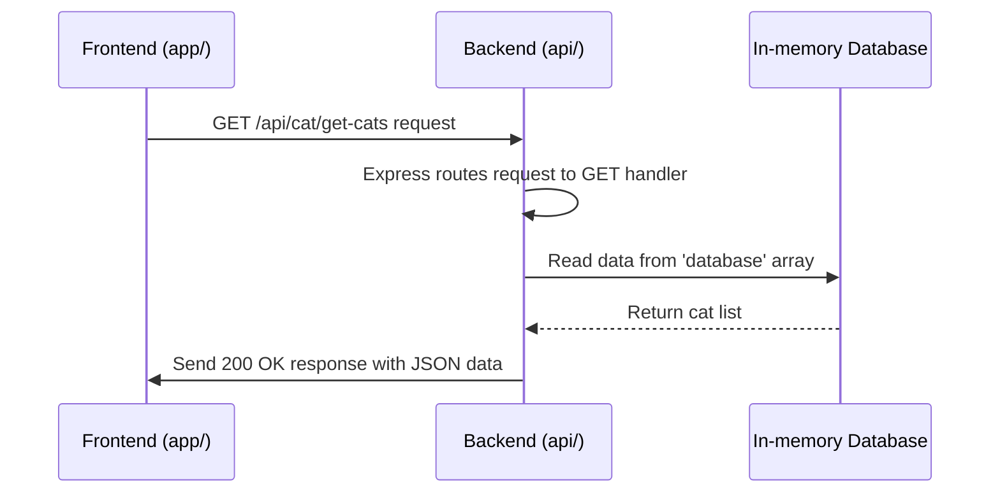
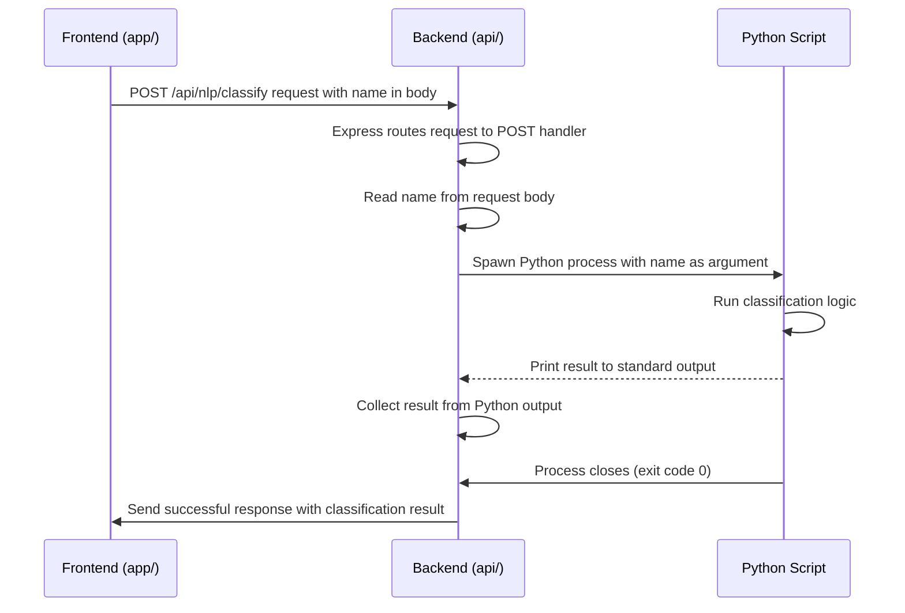

# Chapter 6: Backend API (Express)

Welcome back! In the previous chapter, [Frontend API Interaction](05_frontend_api_interaction_.md), we learned how our frontend application acts like a customer or a waiter, sending requests ("orders") to different APIs using the `fetch` function. Now, let's step into the **kitchen** of our application: the **Backend API**.

The backend is a separate program, running on our computer (or eventually a server somewhere else), that listens for those requests from the frontend. Its job is to receive the order, figure out what needs to be done (like fetching data from a database, performing a calculation, or running a complex process like our machine learning task), prepare the result, and send a response ("the finished dish") back to the frontend.

In this project, our backend is a simple server built using **Node.js** and the popular **Express** framework. It runs locally on your machine, usually on a specific address and port, like `http://localhost:3000`. When the frontend makes a request to an address starting with `http://localhost:3000/api/...`, it's talking to *this* backend.

### Why Do We Need a Backend?

You might wonder, why not do everything in the frontend? Here's why a backend is often necessary:

*   **Data Storage:** Frontends are temporary (closed when the app is shut down). Backends can connect to persistent databases to store data long-term.
*   **Security:** Sensitive logic, API keys, or complex algorithms should not live in the frontend code, which can be easily inspected. The backend keeps these secure.
*   **Complex Processing:** Some tasks require more computing power than a mobile device or browser might have, or involve specialized software (like our Python machine learning model). The backend can handle these heavy tasks.
*   **Centralization:** A single backend can serve multiple frontends (web, iOS, Android), ensuring consistent data and logic.

Our specific backend handles two main types of tasks:

1.  **Managing simple data:** Storing and retrieving a list of `Cat` objects (though in a very basic, temporary way for this tutorial).
2.  **Handling complex tasks:** Receiving a request to classify a cat name's origin by talking to a Python machine learning script.

Let's see how Express helps us do this.

### Express: The Backend Framework

Express is a minimal and flexible Node.js web application framework. It provides a straightforward way to:

1.  **Define Routes:** Set up specific addresses (URLs) that the server should listen to (e.g., `/api/cat/get-cats`, `/api/nlp/classify`).
2.  **Handle Requests:** Receive incoming requests from the frontend (or anywhere else). Express parses the request details like the URL path, HTTP method (GET, POST, etc.), headers, and body data.
3.  **Process Logic:** Run your custom code in response to a request (e.g., look up data, run a calculation).
4.  **Send Responses:** Send data or a status back to the client (the frontend).

All the backend code for this project lives in the `api/` directory, and the main server setup is in `api/index.ts`.

### Setting up Express and Middleware

First, we need to set up our Express application.

```typescript
// api/index.ts (Simplified start)
import express, { Request, Response } from 'express';
// ... other imports (like spawn)

const app = express(); // 1. Create an Express application

// 2. Add middleware to parse JSON bodies
app.use(express.json());

// ... define routes and start server later
```

Explanation:

1.  `const app = express();`: This creates an instance of our Express application. Think of `app` as our main server object that we'll configure.
2.  `app.use(express.json());`: This adds a piece of "middleware" to our application. Middleware are functions that Express runs for incoming requests before they reach our route handlers. `express.json()` is a built-in middleware that automatically parses incoming request bodies that are in JSON format and makes the parsed data available on `req.body`. This is essential for handling POST requests where the frontend sends data in the body.

### Handling GET Requests: Fetching Cat Data

Let's look at how the backend handles the GET request from the frontend asking for the list of cats (`/api/cat/get-cats`). This is used on the `app/(tabs)/register.tsx` screen to display the existing cats.

```typescript
// api/index.ts (Simplified GET route)
// ... middleware setup above

// A very simple "database" in memory
const database: Cat[] = []; // 1. Our temporary data storage

const ROOT_PATH = '/api/cat'; // Base path for cat APIs

// Define the GET route handler
app.get(`${ROOT_PATH}/get-cats`, (_, res: Response) => { // 2. Define a GET route
  try {
    console.log('[GET] Cats fetched successfully');
    // 3. Send a successful response with the data
    res
      .status(200) // Set the HTTP status code to 200 (OK)
      .json({ message: 'Cats fetched successfully', data: database }); // Send JSON response
  } catch (error) {
    // 4. Handle potential errors
    res.status(500).send('Error getting cats'); // Send an error response
  }
});

// ... other routes and start server later
```

Explanation:

1.  `const database: Cat[] = [];`: For this tutorial, we're using a simple JavaScript array (`database`) to store our `Cat` objects. **Important:** This data is *not* saved anywhere permanently. It resets every time the Node.js server is stopped and restarted. In a real application, you'd connect to a database like PostgreSQL, MongoDB, etc., here.
2.  `app.get(`${ROOT_PATH}/get-cats`, (_, res: Response) => { ... });`: This is how we define a GET route.
    *   `app.get()`: Tells Express to handle incoming GET requests.
    *   `${ROOT_PATH}/get-cats`: The specific URL path this handler will respond to (`/api/cat/get-cats`).
    *   `(_, res: Response)`: This is the *request handler function*. It takes two main arguments: `req` (the request object, which we don't need here, hence `_`) and `res` (the response object). This function contains the logic to run when a GET request hits this path.
3.  `res.status(200).json({...});`: Inside the handler, we use the `res` object to build and send the response.
    *   `res.status(200)`: Sets the HTTP status code. `200` means "OK, the request was successful."
    *   `.json({...})`: Sends the response body as JSON. We include a `message` and the actual data (`database`). Express automatically sets the `Content-Type` header to `application/json`.
4.  `try...catch`: Good practice to wrap the logic in a `try...catch` block to catch any unexpected errors during processing and send a `500 Internal Server Error` response back to the client.

Here's a simple flow of a GET request:



### Handling POST Requests: Adding a Cat and Classifying a Name

POST requests are used to send data to the server, often to create or update something, or trigger a process. Our backend handles two POST requests: adding a new cat and classifying a cat name.

Let's first look at adding a cat, which is simpler:

```typescript
// api/index.ts (Simplified POST route for adding cat)
// ... setup and GET route above

// Add a new cat
app.post(`${ROOT_PATH}/add-cat`, (req: Request, res: Response) => { // 1. Define a POST route
  try {
    const cat = req.body as unknown as Cat; // 2. Access the request body
    database.push(cat); // 3. Add the data to our "database"
    console.log('[POST] Cat added successfully');
    // 4. Send a successful response
    res.status(201).json({ message: 'Cat added successfully', data: cat }); // 201 (Created) status
  } catch (error) {
    // Handle errors
    res.status(500).send('Error adding cat');
  }
});

// ... NLP route and start server later
```

Explanation:

1.  `app.post(`${ROOT_PATH}/add-cat`, (req: Request, res: Response) => { ... });`: Defines a POST route for `/api/cat/add-cat`.
2.  `const cat = req.body as unknown as Cat;`: Since we used `app.use(express.json())` middleware, the JSON data sent in the request body is automatically parsed and available as a JavaScript object on `req.body`. We access it here and cast it to our `Cat` type.
3.  `database.push(cat);`: We add the received `cat` object to our temporary `database` array.
4.  `res.status(201).json({...});`: We send a response back. `201 Created` is a standard status code for successful creation of a resource. We send back a confirmation message and the data that was added.

Now, let's look at the POST route for classifying a cat name (`/api/nlp/classify`), which involves interacting with the Python script. This is where the backend acts as an orchestrator.

```typescript
// api/index.ts (Simplified POST route for NLP classification)
// ... setup and other routes above
import { spawn } from 'child_process'; // Need this to run external programs

const NLP_PATH = '/api/nlp'; // Base path for NLP APIs

app.post(`${NLP_PATH}/classify`, (req: Request, res: Response) => { // 1. Define a POST route
  try {
    const { firstName } = req.body as unknown as Cat; // 2. Get data from request body

    // 3. Spawn a new Python process
    const pythonProcess = spawn('python', [
      'nlp_from_scratch/main.py', // The script to run
      '-m', // Argument for the script
      firstName, // The data (name) passed as an argument
    ]);

    let result = '';
    // 4. Collect data from the Python script's output
    pythonProcess.stdout.on('data', (data) => {
      result += data.toString();
    });

    // 5. What to do when the Python process finishes
    pythonProcess.on('close', (code) => {
      if (code === 0) { // Check if Python script exited successfully (code 0)
        console.log('[POST] NLP classification completed');
        // 6. Send successful response with the result
        res.send({ message: 'NLP classification completed', data: result });
      } else {
        // 7. If Python script failed, send an error response
        res.status(500).send('Error analyzing text');
      }
    });

    // Optional: Log errors from the Python process
    pythonProcess.stderr.on('data', (data) => {
      console.error(data.toString());
    });

  } catch (error) {
    // Handle errors during Express processing
    res.status(500).send('Error analyzing text');
  }
});

// ... start server later
```

Explanation:

1.  `app.post(`${NLP_PATH}/classify`, (req: Request, res: Response) => { ... });`: Defines the POST route for `/api/nlp/classify`.
2.  `const { firstName } = req.body as unknown as Cat;`: We access the data sent from the frontend in the request body. We expect a `Cat` object and extract just the `firstName`.
3.  `const pythonProcess = spawn('python', ['nlp_from_scratch/main.py', '-m', firstName]);`: This is the key part for integrating with the Python script. The `spawn` function from Node.js's `child_process` module starts a new process.
    *   The first argument (`'python'`) is the command to run.
    *   The second argument (`[...]`) is an array of arguments passed to the command. We tell Python to run our script (`nlp_from_scratch/main.py`), pass the `-m` flag, and then pass the `firstName` as an argument to the script.
4.  `pythonProcess.stdout.on('data', (data) => { ... });`: This listens for data printed by the Python script to its standard output (like using `print()` in Python). As data comes in, we append it to the `result` variable.
5.  `pythonProcess.on('close', (code) => { ... });`: This event fires when the Python process finishes. The `code` argument is the exit code of the process. `0` usually means success.
6.  `res.send({ message: ..., data: result });`: If the Python script succeeded (exit code 0), we send a successful response back to the frontend, including the `result` we collected from the Python script's output. Note we use `res.send()` here, which is a bit simpler than `.status().json()`. It's flexible and can often infer the `Content-Type`.
7.  `res.status(500).send('Error analyzing text');`: If the Python script failed (non-zero exit code) or an error occurred in our Node.js code, we send an error response.

Here's the flow for the NLP classification request:



This shows how the backend acts as a middleman, receiving the request from the frontend, triggering the Python script, collecting its output, and formatting the final response.

### Starting the Backend Server

Finally, the `api/index.ts` file includes the code to start the Express server and make it listen for incoming connections on a specific port (port 3000 in this project).

```typescript
// api/index.ts (Simplified end)
// ... all route definitions above

// Start the server
app.listen(3000, () => { // Make Express listen on port 3000
  console.log('Server is running on port 3000\n'); // Log a message when server starts
});
```

`app.listen(3000, () => { ... });` tells the Express application to start a web server and listen for requests on port 3000. The callback function is executed once the server has successfully started. When you run `npm start` in the `api/` directory, this is the code that gets executed to launch the backend.

Remember that for the frontend to be able to talk to the backend, *both* need to be running at the same time. You typically start the backend (`cd api && npm start`) in one terminal window and the frontend (`cd .. && npm start`) in another.

### Summary

In this chapter, we explored the Backend API built with Node.js and the Express framework. We learned:

*   The purpose of a backend as the server-side "kitchen" handling data and complex tasks.
*   How Express is used to define routes and handle incoming requests.
*   How GET requests are processed to retrieve data (from our simple in-memory database).
*   How POST requests are processed to receive data (adding a cat) or trigger complex actions (spawning the Python process for NLP classification).
*   How the backend acts as an orchestrator, especially when interacting with other programs like our Python script.
*   That our simple in-memory array serves as a temporary "database" for this tutorial.

We've now seen both sides of the API interaction: the frontend sending requests and the backend receiving and processing them. The backend's ability to interact with other systems, like running external scripts, is a powerful capability. In the next chapter, we'll focus specifically on that connection and dive deeper into the [Machine Learning Integration](07_machine_learning_integration_.md) with the Python script.

[Next Chapter: Machine Learning Integration](07_machine_learning_integration_.md)

---

<sub><sup>Generated by [AI Codebase Knowledge Builder](https://github.com/The-Pocket/Tutorial-Codebase-Knowledge).</sup></sub> <sub><sup>**References**: [[1]](https://github.com/pjnalls/expo-for-architects/blob/f3697ca8ad9d64b842d61f5b3cad4bc1ca57a63b/api/README.md), [[2]](https://github.com/pjnalls/expo-for-architects/blob/f3697ca8ad9d64b842d61f5b3cad4bc1ca57a63b/api/endpoints/Cat.ts), [[3]](https://github.com/pjnalls/expo-for-architects/blob/f3697ca8ad9d64b842d61f5b3cad4bc1ca57a63b/api/endpoints/Nlp.ts), [[4]](https://github.com/pjnalls/expo-for-architects/blob/f3697ca8ad9d64b842d61f5b3cad4bc1ca57a63b/api/index.ts)</sup></sub>