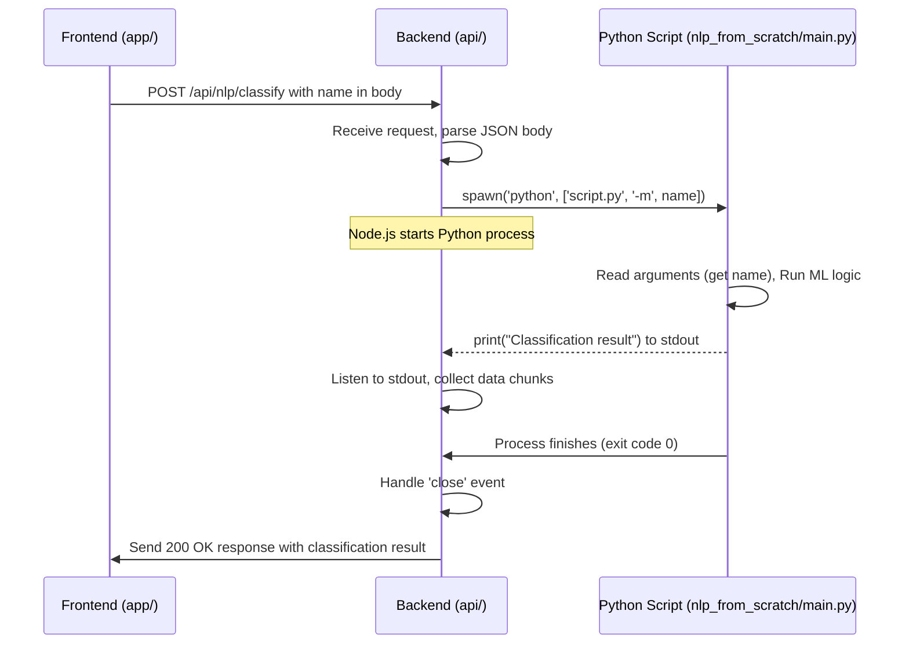

# Chapter 7: Machine Learning Integration

Welcome back! In our previous chapter, [Backend API (Express)](06_backend_api__express__.md), we learned how our Node.js backend acts as the server-side "kitchen," receiving requests from the frontend and handling tasks like storing data or preparing responses. Now, let's explore a more advanced task our backend handles: integrating with a **Machine Learning (ML)** model to perform analysis.

Imagine our kitchen (the Node.js backend) receives a complex order that requires a very specialized technique – something our regular kitchen staff aren't trained for. Instead of trying to do it themselves, they have a dedicated **specialist** working in a separate room (the Python ML script). The kitchen staff pass the complex ingredient (the data) to the specialist, wait for them to perform the analysis, and then receive the result back to incorporate into the final dish.

This is exactly what happens in this part of our application. The frontend sends a cat name to the Node.js backend. The backend doesn't do the machine learning itself; instead, it "calls upon" a separate **Python script** that contains the ML model trained to classify names. The Node.js backend passes the name to the Python script, the Python script runs the classification, outputs the result, and the Node.js backend collects this result and sends it back to the frontend.

### The Problem: Running Specialized ML Tasks on the Backend

Our goal is to allow the frontend to trigger a machine learning classification task. The ML model is written in Python (a common language for ML) and lives as a separate script. Our main backend is in Node.js (JavaScript/TypeScript). How do these two different programs talk to each other and work together?

The challenge is that Node.js doesn't natively run Python code. We need a way for the Node.js process to start the Python process, send it the necessary input data, and receive the output data back.

### The Solution: Spawning a Child Process

Node.js provides a built-in way to run external programs using the **`child_process`** module. The most common function within this module for running standalone scripts is `spawn`.

`spawn` allows our Node.js application to:

1.  Start another program (like the Python interpreter).
2.  Pass command-line arguments to that program (like the name of the script to run and the data to process).
3.  Listen for output printed by the external program to its standard output (`stdout`).
4.  Be notified when the external program finishes executing.

Think of `spawn` as the Node.js backend "opening a window" to the "specialist's room" and saying, "Here's the data, run your analysis, and tell me the result when you're done."

### The Use Case: Classifying a Cat Name's Origin

Let's revisit the `/api/nlp/classify` POST route we saw in the previous chapter ([Backend API (Express)](06_backend_api__express__.md)). This is where the machine learning integration happens.

The frontend sends a `POST` request to this endpoint with a `Cat` object in the body (though the Python script only needs the `firstName`).

```typescript
// Frontend (Simplified request from app/(tabs)/catfact.tsx via api/endpoints/Nlp.ts)
// (Already covered in Chapter 5, just a reminder of the input)
const cat = { firstName: name, /* ... other fields */ };
const originResult = await getClassification(cat); // This function calls the backend
// ... handle originResult in the frontend
```

The backend needs to receive this request, extract the `firstName`, run the Python script with the name as input, and send the script's output back as the response.

### Implementing the Integration in the Backend (`api/index.ts`)

Let's look at the simplified backend code for the `/api/nlp/classify` route again, focusing on the `child_process` part.

```typescript
// api/index.ts (Simplified NLP classify route)
import express, { Request, Response } from 'express';
import { spawn } from 'child_process'; // 1. Import the spawn function
import { Cat } from '@/types/Cat';

const app = express();
app.use(express.json()); // Middleware to parse JSON body

const NLP_PATH = '/api/nlp';

app.post(`${NLP_PATH}/classify`, (req: Request, res: Response) => {
  try {
    const { firstName } = req.body as unknown as Cat; // Get name from frontend

    // 2. Spawn the Python process
    const pythonProcess = spawn('python', [ // 'python': the command
      'nlp_from_scratch/main.py',           // First argument: the script path
      '-m',                                 // Second argument: a flag for the script
      firstName,                              // Third argument: the name from the frontend
    ]);

    let result = ''; // Variable to store output from Python

    // 3. Listen for data output by the Python script
    pythonProcess.stdout.on('data', (data) => {
      result += data.toString(); // Append received data to 'result'
    });

    // 4. Listen for when the Python process finishes
    pythonProcess.on('close', (code) => {
      if (code === 0) { // If exit code is 0 (success)
        console.log('[POST] NLP classification completed');
        // 5. Send the collected result back to the frontend
        res.send({ message: 'NLP classification completed', data: result });
      } else { // If exit code is non-zero (error)
        console.error(`Python script exited with code ${code}`);
        res.status(500).send('Error analyzing text'); // Send error response
      }
    });

    // Optional: Listen for errors from the Python script
    pythonProcess.stderr.on('data', (data) => {
      console.error(`Python Error: ${data.toString()}`);
    });

  } catch (error) {
    console.error('Node.js Error:', error);
    res.status(500).send('Internal server error');
  }
});

// ... server listening code
```

Explanation:

1.  `import { spawn } from 'child_process';`: We import the `spawn` function from Node.js's built-in `child_process` module.
2.  `const pythonProcess = spawn('python', [...]):`: This is the core of the integration. We call `spawn` to start a new process.
    *   The first argument, `'python'`, is the command to execute. This assumes you have the `python` command available in your system's PATH.
    *   The second argument, `['nlp_from_scratch/main.py', '-m', firstName]`, is an array of strings representing the command-line arguments passed to the `python` command.
        *   `'nlp_from_scratch/main.py'`: Tells the `python` interpreter *which script* to run. This path is relative to where the Node.js server process is started (usually the `api/` directory).
        *   `'-m'`: An argument expected by our specific Python script to indicate it should process a name.
        *   `firstName`: The actual name value received from the frontend. `spawn` automatically handles passing this string correctly as a command-line argument.
3.  `pythonProcess.stdout.on('data', (data) => { ... });`: The `spawn` function returns a `ChildProcess` object (`pythonProcess`). This object has a `stdout` property, which is a stream representing the Python script's standard output. We listen for the `'data'` event on this stream. Each time the Python script `print`s something, this event fires, and the printed data arrives in chunks in the `data` argument. We collect all these chunks into the `result` variable.
4.  `pythonProcess.on('close', (code) => { ... });`: This listens for the `'close'` event, which fires when the Python script finishes executing. The `code` argument is the script's exit code. An exit code of `0` is the standard convention for success.
5.  `res.send({ message: ..., data: result });`: If the Python script finished successfully (`code === 0`), we send the collected `result` (the classification output from the Python script) back to the frontend in a JSON response. If the exit code is non-zero, we send a 500 error, indicating something went wrong with the Python script.

The Python script (`nlp_from_scratch/main.py`) itself is responsible for reading the command-line arguments (using something like `sys.argv` or the `argparse` module), performing the ML classification using its trained model, and then printing the final classification result to its standard output using `print()`.

### How it Works Together (Simplified Flow)

Here's the flow from the frontend request through the backend to the Python script and back:



This diagram shows how the Node.js backend acts as the middleman, receiving the initial request, delegating the core task to the Python "specialist" via `spawn`, and then relaying the specialist's findings back to the frontend.

### Why Use This Integration Pattern?

*   **Using the Right Tools:** Python is excellent for ML. Node.js is excellent for building web servers and APIs. This pattern lets us use the best tool for each job.
*   **Separation of Concerns:** The ML logic is separate from the API handling logic, making each part easier to develop and maintain.
*   **Resource Isolation:** The Python script runs in its own process. If the ML task is computationally intensive, it runs outside the main Node.js event loop, preventing the API server from becoming unresponsive.

This approach is suitable for tasks that can be completed relatively quickly and where the input/output data is manageable. For very long-running ML tasks or large data transfers, other patterns like message queues might be considered, but for this example, `spawn` is a straightforward and effective method.

### Summary

In this chapter, we explored how our Node.js backend integrates with a separate Python machine learning script to perform specialized analysis. We learned how Node.js's `child_process.spawn` function is used to start the Python process, pass data via command-line arguments, and receive results by listening to the script's standard output. This pattern allows us to leverage the strengths of different programming languages within a single application architecture, with the backend acting as the orchestrator.

Understanding how different parts of an application, even written in different languages, can communicate and work together is a key skill in building larger systems. We've now seen how frontend talks to backend, and how backend can talk to other processes.

Our final chapter will look at how to handle differences between running our application on different platforms, like web and mobile.

[Next Chapter: Cross-Platform Handling](08_cross_platform_handling_.md)

---

<sub><sup>Generated by [AI Codebase Knowledge Builder](https://github.com/The-Pocket/Tutorial-Codebase-Knowledge).</sup></sub> <sub><sup>**References**: [[1]](https://github.com/pjnalls/expo-for-architects/blob/f3697ca8ad9d64b842d61f5b3cad4bc1ca57a63b/api/endpoints/Nlp.ts), [[2]](https://github.com/pjnalls/expo-for-architects/blob/f3697ca8ad9d64b842d61f5b3cad4bc1ca57a63b/api/index.ts), [[3]](https://github.com/pjnalls/expo-for-architects/blob/f3697ca8ad9d64b842d61f5b3cad4bc1ca57a63b/app/(tabs)/catfact.tsx)</sup></sub>