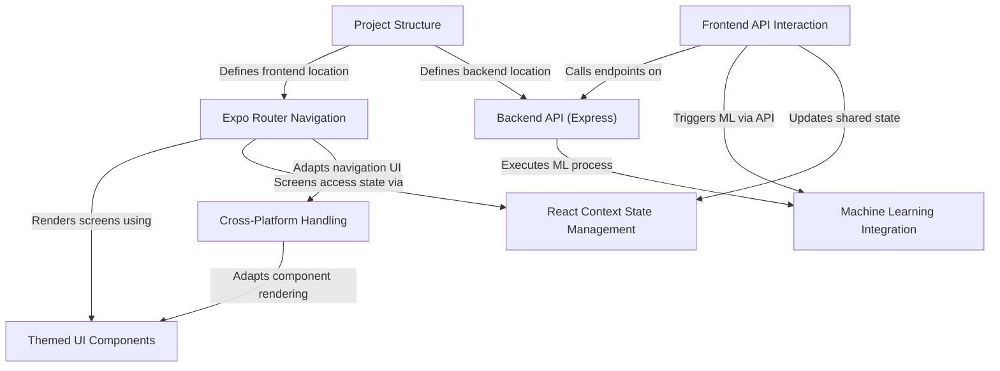

# Tutorial: expo-for-architects

This project is an example of a **full-stack, cross-platform** application built with Expo.
It features a React Native frontend (`app/`) that interacts with a Node.js/Express backend (`api/`).
The app demonstrates **themed UI components**, **navigation** using Expo Router, **API communication** (both local and external), and **integrates machine learning** via a backend Python process.
It also highlights **cross-platform development** techniques for iOS, Android, and Web.

## Visual Overview

## Chapters

1. [Project Structure
](01_project_structure_.md)
2. [Expo Router Navigation
](02_expo_router_navigation_.md)
3. [Themed UI Components
](03_themed_ui_components_.md)
4. [React Context State Management
](04_react_context_state_management_.md)
5. [Frontend API Interaction
](05_frontend_api_interaction_.md)
6. [Backend API (Express)
](06_backend_api__express__.md)
7. [Machine Learning Integration
](07_machine_learning_integration_.md)
8. [Cross-Platform Handling
](08_cross_platform_handling_.md)

---

Generated by [AI Codebase Knowledge Builder](https://github.com/The-Pocket/Tutorial-Codebase-Knowledge).