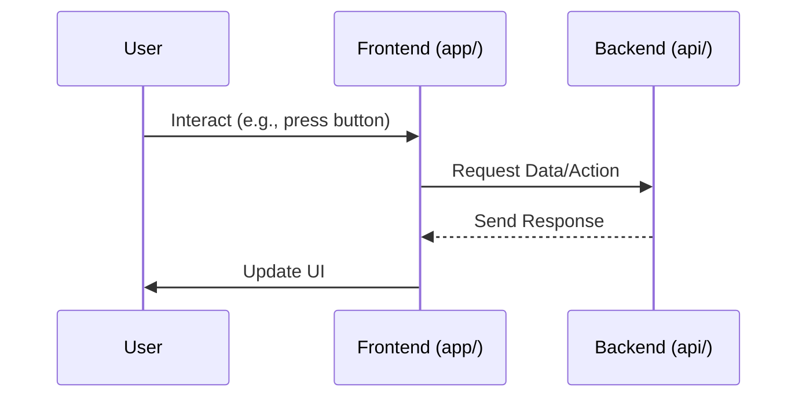

# Chapter 1: Project Structure

Welcome to the `expo-for-architects` tutorial! In this first chapter, we'll start by getting familiar with how the project is organized. Think of a large building – it's not just one big room! It has different sections like a kitchen, bedrooms, bathrooms, etc., each with a specific purpose. Our application's codebase is similar; it's divided into different directories, each holding different parts of the application.

Understanding this layout is super helpful because it tells you exactly where to look for specific code. If you want to change how a screen looks, you go to one place. If you want to change how the server handles data, you go to another. This separation makes large projects much easier to manage and understand.

In this project, we have both a **frontend** (what you see and interact with on your phone or web browser) and a **backend** (a server that handles data, like our machine learning features). A good structure keeps these main parts separate but also provides common places for things they might share.

Let's look at the main directories you'll see at the top level of the project:

```
├── api/              # Backend RESTful APIs
├── app/              # Main application screens
├── assets/           # Static assets
├── components/       # Reusable UI components
├── contexts/         # React Context providers
├── hooks/            # React Hook dynamic schemes
├── scripts/          # Development utility scripts
└── types/            # Types throughout solution
```

Let's break down the most important ones for a beginner:

### `app/` - The Frontend (Your "Dining Area")

This is where all the code for the user interface lives. When you run the Expo app on your phone or web browser, everything you see and click on comes from the code inside this `app/` directory. It uses the Expo framework and React Native to build the user experience.

### `api/` - The Backend (Your "Kitchen")

This directory contains the code for our server. This backend uses Node.js and the Express framework. The server's job is to handle requests from the frontend, do things like process data, interact with machine learning models (which we'll see later!), and send responses back to the frontend. This is your "kitchen" where the data is prepared before being served to the user interface.

### Shared Directories

Some things are useful for multiple parts of the application, especially for the frontend (`app/`). These are often placed in directories at the root level, outside of `app/` and `api/`, so they can be easily imported and used wherever needed.

*   `components/`: This holds reusable pieces of the user interface, like buttons, text boxes, or custom views. If you build a button you want to use on many different screens, you'd put its code here.
*   `contexts/`: This is related to managing data that many parts of the frontend need access to, using a concept called [React Context State Management](04_react_context_state_management_.md) (we'll cover this in a later chapter).
*   `hooks/`: This contains custom React Hooks, which are a way to reuse logic in functional components.
*   `assets/`: This is where static files like images (`splash-icon.png` is here), fonts, or other media files are stored.
*   `types/`: This directory is for defining data structures or "types" that are used throughout the project, helping ensure consistency and catch errors early, especially if you're using TypeScript (which this project does).

### How They Connect

The main interaction flow is typically:

1.  The user interacts with something in the `app/` (the frontend).
2.  The `app/` needs some data or needs to perform an action that only the server can do (like running an ML model).
3.  The `app/` sends a request to the `api/` (the backend).
4.  The `api/` processes the request, maybe fetches data or runs a calculation.
5.  The `api/` sends a response back to the `app/`.
6.  The `app/` receives the response and updates the user interface accordingly.

Here's a super simple diagram showing this basic interaction:



Understanding this structure and the basic flow helps you locate the relevant code files. For example, if there's an issue with how data is displayed on a screen after fetching it, you'd primarily look in `app/`. If the issue is with how the data is processed on the server or what data is sent back, you'd look in `api/`.

This layered approach keeps the user interface concerns separate from the server logic, making the project cleaner, more maintainable, and easier for teams to work on different parts simultaneously.

That's the basic map of our project! We've seen the main territories (`app/` and `api/`) and some important shared locations.

In the next chapter, we'll dive into how you navigate between different screens within the `app/` frontend using something called [Expo Router Navigation](02_expo_router_navigation_.md).

[Next Chapter: Expo Router Navigation](02_expo_router_navigation_.md)

---

<sub><sup>Generated by [AI Codebase Knowledge Builder](https://github.com/The-Pocket/Tutorial-Codebase-Knowledge).</sup></sub> <sub><sup>**References**: [[1]](https://github.com/pjnalls/expo-for-architects/blob/f3697ca8ad9d64b842d61f5b3cad4bc1ca57a63b/README.md), [[2]](https://github.com/pjnalls/expo-for-architects/blob/f3697ca8ad9d64b842d61f5b3cad4bc1ca57a63b/api/README.md)</sup></sub>