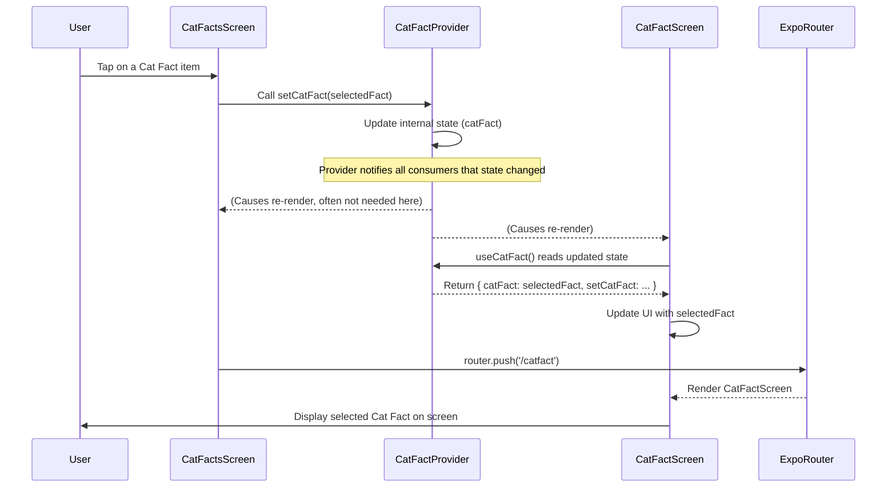

# Chapter 4: React Context State Management

Welcome back to the `expo-for-architects` tutorial! In our previous chapter, [Themed UI Components](03_themed_ui_components_.md), we learned how to create user interface elements that automatically adapt their appearance based on the user's preferred light or dark theme. Now, let's shift our focus from *how things look* to *how we manage and share data* across different parts of our application.

Imagine your app is a building, and you have different rooms (components) on different floors. Sometimes, information in one room needs to be known or used in a room on a completely different floor, maybe even another wing. The simplest way to share information between rooms that are close together is to just pass a note directly. But what if the rooms are far apart? You could pass the note from person to person through every single room and hallway in between. This works, but it's tedious, prone to errors (what if someone drops the note?), and makes the building's structure rigid – if you move a room, you have to rethink the whole note-passing route!

In React, passing data through every layer of nested components is called **"prop drilling."** It happens when you have data in a parent component that several distant child components need. You have to pass that data down as `props` through *every* component in between, even if those intermediate components don't actually need the data themselves.

This is where **React Context** comes to the rescue. React Context provides a way to create a "shared bulletin board" or a "global whiteboard" where you can post information, and *any* component within a certain area of your app can access that information directly, without needing it passed down through props from their parents. This is incredibly useful for managing data that many parts of your app need, like the current user's login status, theme preferences (though we used hooks for theme in the last chapter, Context is often used for this too!), or in our specific project's case, the "current Cat Fact" that the user has selected from a list.

### The Use Case: Sharing the Selected Cat Fact

Let's look at our project's "Cat Facts" feature.
*   We have a list of cat facts on the `/catfacts` screen (`app/(tabs)/catfacts.tsx`).
*   When a user taps on one of the facts in the list, we navigate them to the `/catfact` screen (`app/(tabs)/catfact.tsx`).
*   The `/catfact` screen needs to know *which* cat fact was selected so it can display the full details or use it for other actions (like sending it to the AI).

How can we get the selected `CatFact` object from the list component in `catfacts.tsx` over to the display component in `catfact.tsx`? They are different screens, potentially rendered by different parent components within the tab navigation structure.

We *could* try passing it as a navigation parameter (as you might have seen briefly in the [Expo Router Navigation](02_expo_router_navigation_.md) chapter), but navigation parameters are often limited in size and complexity. For larger or more complex data, or data that might be needed by *multiple* different screens or components that aren't directly linked by navigation, Context is a more robust solution.

Context allows the component that *selects* the fact (`catfacts.tsx`) to "post" the selected fact to the shared board, and the component that *displays* the fact (`catfact.tsx`) can "read" from that same board.

### Key Concepts of React Context

React Context involves three main pieces:

1.  **The Context Object:** This is like the blank bulletin board itself, created using `React.createContext()`. It's the connection point.
2.  **The Provider:** This is the component that manages the data you want to share (the state) and "provides" it to the components nested inside it. It's like the person in charge of writing on the bulletin board. Any component *within the Provider's tree* can access the shared data.
3.  **The Consumer (or `useContext` Hook):** This is how components read the data from the shared board. The `useContext` hook (recommended for modern React) is the easiest way. Components using `useContext` can tap into the nearest Provider for that specific Context and get the current shared data.

```mermaid
graph TD
    A[Root App Component] --> B[Some Parent Component];
    B --> C[Another Component];
    C --> D[Component Needing Data];
    C --> E[Component Providing Data];

    subgraph Context Flow
        E --> F{Context Provider};
        F -- Provides Data --> G[Components Inside Provider];
        G --> H[Component Reading Data with useContext];
    end

    D -- Prop Drilling --> C;
    C -- Prop Drilling --> B;
    B -- Prop Drilling --> A;

    H -- Reads Data Directly --> F;

    linkStyle 0,1,2,3,4,5,6,7 stroke:#ff3333
    linkStyle 8,9 stroke:#33cc33

    classDef red fill:#f9f,stroke:#333,stroke-width:2px;
    classDef green fill:#bfb,stroke:#333,stroke-width:2px;

    class D,C,B,A red;
    class G,H green;
    class F green;

    Note right of D: Data needs to go UP then DOWN (Prop Drilling)
    Note right of H: Data read directly from Provider (Context)
```

*(Simplified Diagram: Showing Prop Drilling vs. Direct Access with Context)*

### Solving the Cat Fact Use Case with Context

Our project uses Context to manage the selected cat fact. Let's see how the pieces fit together.

**Step 1 & 2: Create the Context and the Provider (`contexts/CatFactContext.tsx`)**

This file defines our "shared bulletin board" for the cat fact.

```typescript
// contexts/CatFactContext.tsx - Simplified
import { createContext, useContext, useState, ReactNode } from 'react';
import { CatFact } from '@/types/Cat'; // CatFact type definition

// 1. Define the shape of the data we want to share
type CatFactContextType = {
  catFact: CatFact | undefined; // The currently selected fact
  setCatFact: (catFact: CatFact | undefined) => void; // Function to update it
};

// 2. Create the Context object
// We give it an initial undefined value.
const CatFactContext = createContext<CatFactContextType | undefined>(undefined);

// 3. Create the Provider component
export function CatFactProvider({ children }: { children: ReactNode }) {
  // This is where we hold the actual state!
  const [catFact, setCatFact] = useState<CatFact | undefined>(undefined);

  // The Provider component wraps its children
  return (
    // It uses .Provider and passes the state and updater function in the 'value' prop
    <CatFactContext.Provider value={{ catFact, setCatFact }}>
      {children} {/* All components inside 'children' can access the value */}
    </CatFactContext.Provider>
  );
}

// 4. Create a custom hook for easy access (Optional but common)
export function useCatFact() {
  const context = useContext(CatFactContext); // Read the value from the nearest Provider
  // Good practice: check if the hook is used without a Provider
  if (context === undefined) {
    throw new Error('useCatFact must be used within a CatFactProvider');
  }
  return context; // Return the shared data and updater
}
```

*   `createContext`: We create the `CatFactContext`.
*   `CatFactProvider`: This component will wrap the part of our application where we want the `catFact` state to be accessible. It uses `useState` to keep track of the `catFact` and provides *both* the current `catFact` *and* the `setCatFact` function through its `value` prop.
*   `useCatFact`: This is a simple custom hook that makes it easy for any component to `useContext(CatFactContext)` without needing to import `CatFactContext` directly everywhere. It also adds a helpful check to make sure the Provider is being used correctly.

**Where is the `CatFactProvider` used?**

For the `useCatFact` hook to work anywhere it's needed (like in `catfacts.tsx` and `catfact.tsx`), the `CatFactProvider` must be rendered *above* those components in the component tree. In this project structure, providers for global state are often placed in the root `app/_layout.tsx` file, wrapping the main content rendered by Expo Router. This makes the context available to *all* screens within the `app` directory.

**Step 3: Using the Context (`useCatFact`)**

Now, any component rendered inside the `CatFactProvider` can use the `useCatFact` hook to access the shared data (`catFact`) and the function to update it (`setCatFact`).

**In `app/(tabs)/catfacts.tsx` (The List Screen):**

This screen needs to *update* the shared `catFact` when a user taps on an item in the list.

```typescript
// app/(tabs)/catfacts.tsx - Simplified relevant parts
import { useCatFact } from '@/contexts/CatFactContext'; // Import the hook
import { router } from 'expo-router'; // For navigation
import { CatFact } from '@/types/Cat'; // CatFact type

export default function CatFactsScreen() {
  // ... other state and logic for fetching the list

  // Get the function to update the shared state
  const { setCatFact } = useCatFact();

  // Function called when a list item is pressed
  const handleCatFactPress = (fact: CatFact) => {
    // Update the shared state with the selected fact
    setCatFact(fact);
    // Navigate to the screen that will display this fact
    router.push('/catfact');
  };

  // ... rest of the component rendering the FlatList
  // In the renderItem function for the FlatList:
  // <TouchableOpacity onPress={() => handleCatFactPress(item)}>
  //   ... render fact text ...
  // </TouchableOpacity>
}
```

*   We use `useCatFact()` to get the `{ setCatFact }` function.
*   When an item is pressed, `handleCatFactPress` is called.
*   Inside this function, we call `setCatFact(fact)` to update the state held by the `CatFactProvider`. Because this is shared state, any other component using `useCatFact` will now have access to this new `fact`.
*   Then, we navigate to the `/catfact` screen.

**In `app/(tabs)/catfact.tsx` (The Detail Screen):**

This screen needs to *read* the shared `catFact` to display it.

```typescript
// app/(tabs)/catfact.tsx - Simplified relevant parts
import { useCatFact } from '@/contexts/CatFactContext'; // Import the hook
import { ThemedText } from '@/components/ThemedText'; // Themed text component

export default function CatFactScreen() {
  // Get the shared catFact state
  const { catFact } = useCatFact();

  // ... other state and logic (like the AI classification part)

  return (
    // ... component structure
    <ThemedText>{`${catFact?.fact.substring(0, 100)}...`}</ThemedText>
    // ... rest of the component
  );
}
```

*   We use `useCatFact()` to get the `{ catFact }` state.
*   We can now directly use the `catFact` variable to display the selected fact's text.
*   Whenever `setCatFact` is called elsewhere (like in `catfacts.tsx`), this component will automatically re-render because the value returned by `useCatFact` has changed.

### How it Works Under the Hood (Simplified Flow)

Let's trace the process when a user selects a cat fact from the list:



Essentially:
1.  The user interacts with the list screen (`CatFactsScreen`).
2.  `CatFactsScreen` calls the `setCatFact` function obtained from the `useCatFact` hook, passing the `selectedFact`.
3.  The `CatFactProvider` (which is managing the actual `catFact` state via `useState`) receives the update and changes its internal state.
4.  When the state inside the `CatFactProvider` changes, it automatically notifies *all* components that are using `useCatFact` and are rendered within its tree.
5.  These components (like `CatFactScreen`) automatically re-render.
6.  During the re-render, `CatFactScreen` calls `useCatFact()` again, and this time it receives the *new*, updated `catFact` value.
7.  `CatFactScreen` uses this new value to display the correct fact text in its UI.
8.  Meanwhile, `CatFactsScreen` also triggers the navigation to the `CatFactScreen`.

### Summary

React Context provides a powerful and clean way to manage state that needs to be shared widely across components without resorting to cumbersome prop drilling. By defining a Context with a Provider and using the `useContext` hook (or a custom hook like `useCatFact`), components can easily access and update shared data from anywhere within the Provider's scope. This makes your component tree cleaner, more flexible, and easier to understand, especially for data that feels "global" or "semi-global" to your application's frontend.

Now that we know how to manage state within the frontend and share it between screens, where does that data actually come from? Often, it comes from an external source, like a server. In the next chapter, we'll explore [Frontend API Interaction](05_frontend_api_interaction_.md) and learn how our frontend communicates with external APIs (like the one providing the Cat Facts!).

[Next Chapter: Frontend API Interaction](05_frontend_api_interaction_.md)

---

<sub><sup>Generated by [AI Codebase Knowledge Builder](https://github.com/The-Pocket/Tutorial-Codebase-Knowledge).</sup></sub> <sub><sup>**References**: [[1]](https://github.com/pjnalls/expo-for-architects/blob/f3697ca8ad9d64b842d61f5b3cad4bc1ca57a63b/app/(tabs)/catfact.tsx), [[2]](https://github.com/pjnalls/expo-for-architects/blob/f3697ca8ad9d64b842d61f5b3cad4bc1ca57a63b/app/(tabs)/catfacts.tsx), [[3]](https://github.com/pjnalls/expo-for-architects/blob/f3697ca8ad9d64b842d61f5b3cad4bc1ca57a63b/app/(tabs)/index.tsx), [[4]](https://github.com/pjnalls/expo-for-architects/blob/f3697ca8ad9d64b842d61f5b3cad4bc1ca57a63b/contexts/CatFactContext.tsx)</sup></sub>